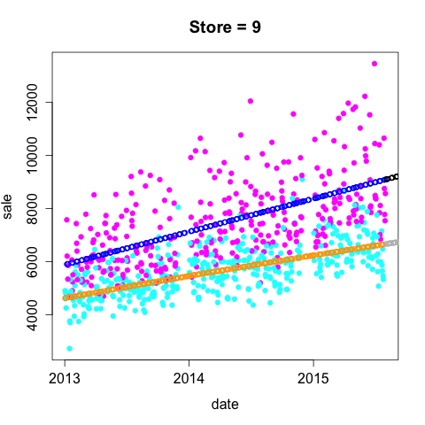
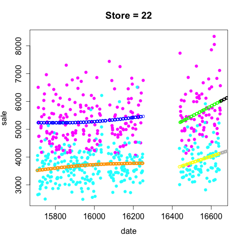
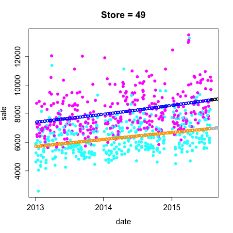
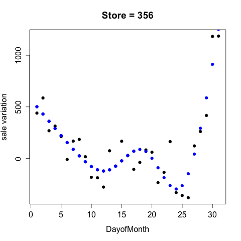
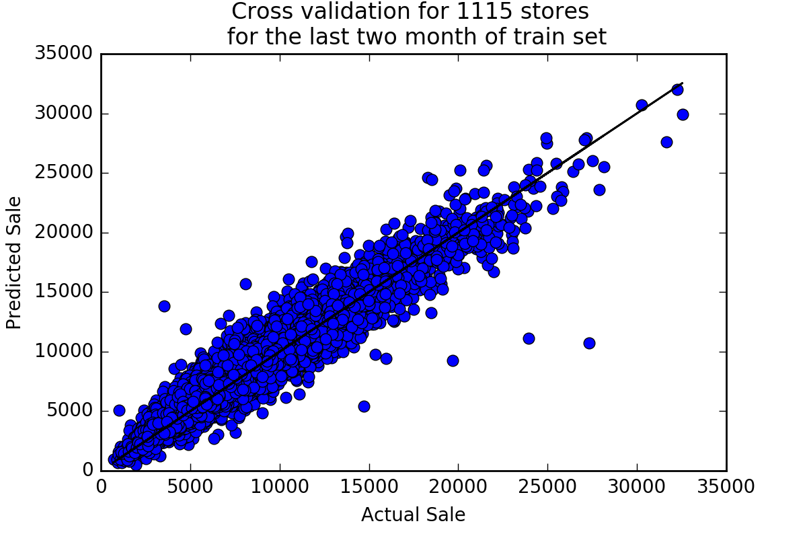

# Sale Forecasting 
*(Rossmann Kaggle Data Science Challenge)*

**Team:**

- Arman Akbarian
- Ali Narimani

## Description

The project is to predict the sale of 1115 stores for the next 2 month given
the sale of the previous 31 month during 2013 - 2015. The sale data
(``train.csv``) contains:

### Data Fields

* **Id**: (Store,Date) unique ID
* **Store**: Store ID (int 1-1115) 
* **Sale**: Sale at the given date for the given store
* **Customers**: Number of costumers that day
* **Open**: If the store is open or not (0,1)
* **StateHoliday**: if the date is one of 4 types of holidays, including None holidays
* **SchoolHoliday**: If the date is a school holiday
* **Promo**: If there is a promotion that day in the store

The (``store.csv``) contains information about each store:

* **StoreType**: Some "type" for stores: 4 category
* **Assortment**: Store assortment, category of 3 types
* **CompetitionDistance**: Distance in meter to the nearest competitor
* **CompetitionOpenSince**: Date the competition opened
* **Promo2**: If store is participating in another seasonal promotion
* **Promo2Since**: Date the promo2 program started
* **PromoInterval**: The month labels that promo2 runs in the store if it participates


### Data Size


The sale date is about \\( 1.01 \times 10^6 \\) training data point for all the 1115 point
The test data (evaluation for competition) contains the next 2 month of
(unknown to us) sale for some of the stores -- about: \\( 4.1 \times 10^4 \\)

* **Train**: 1,017,209
* **Test** :  41,088 (out of the date range of the train set)

### Download data
The data can be downloaded from [[here[>]]](https://www.kaggle.com/c/rossmann-store-sales/data)


****

## Data preprocessing and cleaning

### Merging Store Information
We first merge the store attributes with the training set, and calculate some date variables such
as day of the month, year and month:

```python

```


### Cleaning Promo2 and Competition

``Promo2`` variable is given as intervals. For example string of format ``"Apr,May,Aug,Dec"`` and
also the date it starts. We convert this to a single binary variable that indicates if at that date
Promo2 is active or not.

We also build a binary feature that indicates if there exist a competition at a given date or not.
The original version of the given data only indicates when the competition opened.

```python

```

### Finding Renovated Stores 

As indicated in the project description, some of the stores are gone through renovation process
in late 2014 and re-opened in 2015. We find those stores and build a binary feature that turns on
after renovation. This allows us to do a separate analysis of after renovation, since our exploratory
data analysis indicates that sale sometimes drastically changes after renovation. 

```python
```

### Preprocessing code

* [[Full code]](preprocessing.py)


*** 

## Seasonality / Sale Trend and Regression

After exploring the data, we first look into the daily sale and build an "average" sale window for each 
month using a regression model (spline fit). Note that we fit to the after renovated data separately, as 
well as we fit to the days with promotions separately. 

Before looking at the R code, let's take a look at some examples of sale trends of the 2 years for
some of the stores: (magenta indicates days with promotion, cyan is without promotion)

The curved "line dots" indicates the result of the spline regression. The tail black/grey color
indicates the extrapolation of the trend to the test set that is outside the range date for
the train set.

The gap indicates renovation, the fit to the data after renovation is independent of previous sale
before renovation.

### Yearly Trend






Majority of stores follow a similar pattern, however we do have few irregular stores:
[!alt_tag](img/Store_262_SaleTrend.png)


Note that in the code we remove the month of december from regression since in several stores in is a
point of anomoly.

```R

```


### Monthly Trend

After removing the yearly trend of sale growth/decay. It makes more sense to bin the data to day of
month, and we observe strong indication of a seasonality in month that sale is higher near the beginning
and end of the month, and also slightly higher in the middle. We also extracted this signal. 

Let's first take a look at some of the stores sale: (the blue dots indicate
the spline fit) 





The implementation is below:

```R

```

Finally we store the normalized data for the final step of the ML pipeline. 

### Regression Code

* [[Full code]](regression.R)


****

## Non-linear features / XGB

Finally to extract the nonlinear features such as dependency of the sale on day of week
or its dependency on when promo2 is on as well as interaction terms such as 
(end of month x Friday) we use a gradient boosting decision tree:

So in summary our machine learning pipeline looks like the following:


```python
```

### code

* [[Full code]](XGB.py)

## Cross Validation

Note that the code above performs a cross validation by holding the last two month of the train set out
of the XGBoost. (Also XGBoost has it's own built in CV monitoring). Following plot demonstrates the
predicted sale vs actual sale for the cross validation set with RMSPE score of 0.14 



